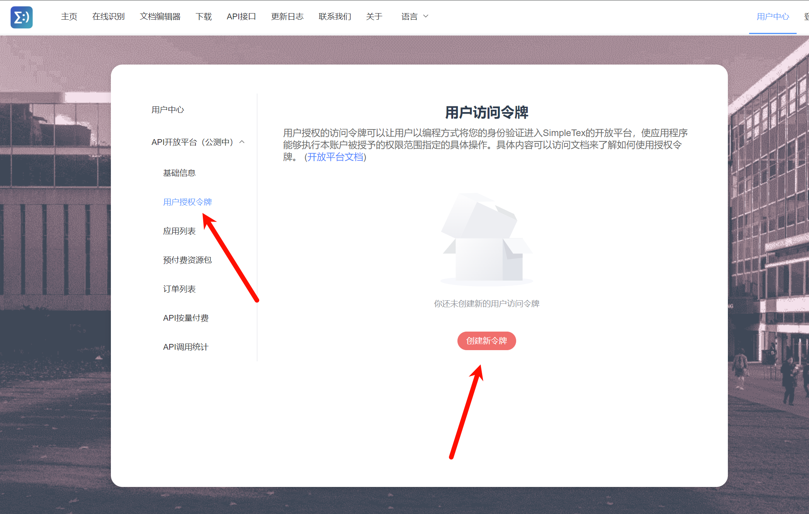

# Simple LaTeX

:::info
文档内容可能会过时，请以 [Simple LaTeX 说明](https://simpletex.cn/api_doc) 为准。
:::

## 价格

- 当前初始赠送1000次免费调用，每月可在控制台领取1000次免费调用资源包。

- 目前有两种计费方式，第一种是按量付费，另一种是通过预付费的资源包进行调用抵扣。

- **API按量付费（下列价格为 Simple LaTeX API 测试期间的价格，可能会发生改变，请以官方文档为准。）**

  | 月调用量（次） | 价格（元/次） | 区间上限调用价格（元） |
  | -------------- | ------------- | ---------------------- |
  | <1000          | 0.15          | 150                    |
  | 1000-5000      | 0.12          | 150+480=630            |
  | 5000-10000     | 0.10          | 630+500=1130           |
  | 10000-50000    | 0.08          | 1130+3200=4330         |
  | 50000-100000   | 0.06          | 4330+3000=7330         |
  | >100000        | 0.04          | /                      |

  其中，每月1号凌晨0时清空记录，按阶梯次进行计费。例如请求了5000次，其中头1000次按0.15元收费，1001-2500次按0.12元收费，并以此类推。其中不论是按量付费还是预付费资源包的调用次数均记录在当月总调用量中。

- **预付费资源包（下列价格为 Simple LaTeX API 测试期间的价格，可能会发生改变，请以官方文档为准。）**

  | 资源包调用量（次） | 资源包价格（元） | 有效期 |
  | ------------------ | ---------------- | ------ |
  | 1000               | 140              | /      |
  | 2500               | 300              | /      |
  | 5000               | 550              | /      |
  | 10000              | 1000             | /      |
  | 100000             | 6000             | 1年    |
  | 1000000            | 36000            | 1年    |

  

## 申请步骤

### 第一步：注册登录

前往[官网](https://simpletex.cn/user/register)注册并登录

### 第二步：开通API开放平台账户

在登陆后，前往用户中心，然后点击左侧的 API开放平台（公测中） -  基础信息，并点击“立即开通”。

阅读协议并同意。

### 第三步：创建访问令牌

点击左侧“用户授权令牌”，并点击“创建新令牌”。

输入一个令牌名称。

创建成功，点击红色箭头所指处的复制按钮，复制令牌信息。

### 第四步：将令牌填入 pot 设置

将复制的 令牌 填入 pot 的【设置页】-【服务设置】-【文字识别】 - 【添加内置服务】 - 【Simple LaTeX】中的 Token 参数即可。

### 第五步：每月领取资源包

Simple LaTeX初始赠送了1000次请求，同时每月可领取1000次调用资源包。

第一个月可同时领取初始赠送资源包与每月免费资源包。

可点击左侧“预付费资源包”后，点击页面下方的“点此免费领取每月免费用量”。

## 相关链接

[Simple LaTeX](https://simpletex.cn/)

[Simple LaTeX 开放平台接口文档](https://simpletex.cn/api_doc)
