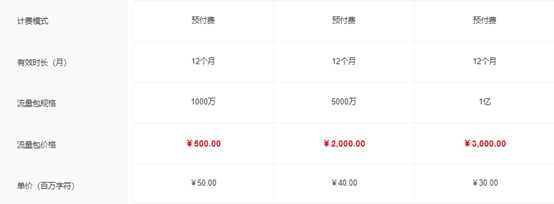
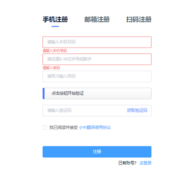
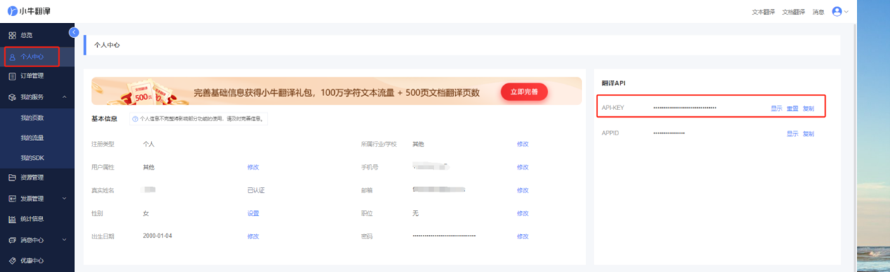

# 小牛翻译

:::info
文档内容可能会过时，请以小牛翻译官网说明为准。
:::

## 价格

小牛翻译每天提供免费的20万字符流量，当日有效。超出后会按照 30~50 元 / 百万字符收取费用，费用由小牛翻译云平台收取，与 pot 无关。

:::info
通过 [pot用户专属注册链接](https://niutrans.com/login?active=3&userSource=pot) 注册小牛翻译账号，额外赠送200万字符流量
:::

小牛翻译采用预付费模式，每天免费的20万流量消耗完成后，需要购买流量包才可继续使用。使用过程中将优先消耗每日的免费赠送流量。

## 申请步骤

### 第一步：注册或登录

点击 [pot用户专属注册链接](https://niutrans.com/login?active=3&userSource=pot) 注册小牛翻译账号，如果已有账户则选择登录，如果没有则进行注册。

### 第二步：获取小牛翻译 API Key

点击跳转[获取秘钥页面](https://niutrans.com/cloud/account_info/info)
登录 `控制台`，选择 `个人中心` ，在翻译API部分可看到，查看及复制前需先点击右侧的显示按钮，将“**”符号变为具体内容。（绑定手机号之后才可以查看哦）

### 第三步：小牛翻译 API KEY 填进 pot

将上一步获取的小牛翻译 `API Ket` 填写进 pot 的【设置页】-【服务设置】-【翻译】-【添加内置服务】-【小牛翻译】- 【Api Key】 即可。

## 相关链接

[pot用户小牛翻译专属注册链接](https://niutrans.com/login?active=3&userSource=pot)

[小牛翻译 API 定价文档](https://niutrans.com/price)